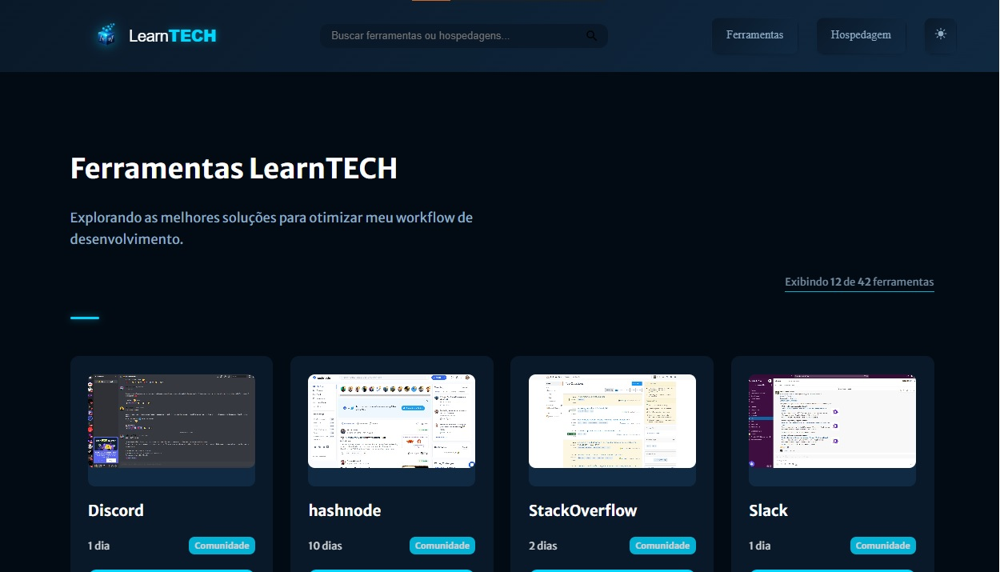
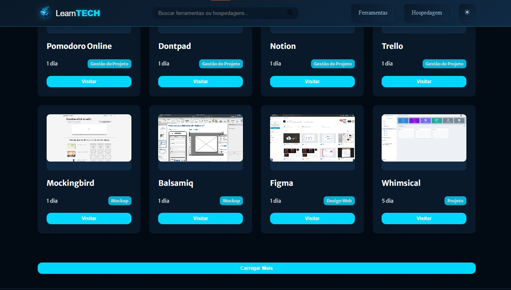
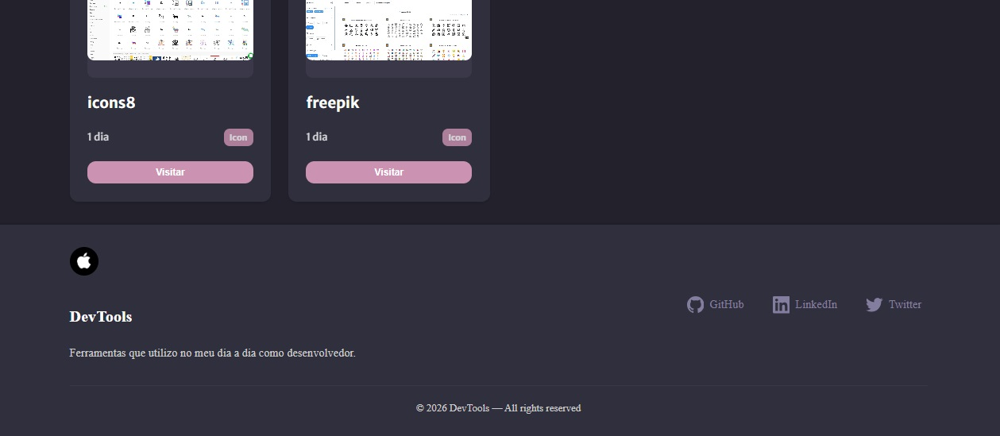

<h4 align="center"> 
	🚧 Tools 🚀
</h4>

## Evolução da Plataforma

- [x] Menu e Lista de Cards

<p align="center" style="display: flex; align-items: flex-start; justify-content: center;">
  
</p>  

- [x] Barra de Busca e Resultado de Card

<p align="center" style="display: flex; align-items: flex-start; justify-content: center;">
  
</p>  

- [x] Footer

<p align="center" style="display: flex; align-items: flex-start; justify-content: center;">
  
</p>  

### 💻 Funcionalidades

- [ ] Paginação
- [x] Botão Menu
- [x] Footer
- [x] Header 
- [x] Design do Ecossistema
- [ ] Favicon do Ecossistema

### 📂 Estrutura de pastas

#### 📁 Root (Raiz)

- index.html: O ponto de entrada da aplicação.
- main.js: O "cérebro" do projeto, onde reside a lógica de renderização e eventos.
- Readme.md: Documentação técnica do repositório.

#### 📁 assets/ (Recursos Estáticos)

É a pasta mais densa do projeto, dividida por categorias:

- icons/: Contém todos os ícones funcionais em formato .svg (briefcase, github, globe, mail, map-pin, etc.).
- logos/: Armazena a identidade visual (ex: logo-1.jpg).
- thumb_host/: Imagens de pré-visualização para serviços de hospedagem (Firebase, Netlify, Vercel, etc.).
- thumb_tools/: A maior coleção de imagens, com os thumbnails das ferramentas (Figma, Trello, Slack, Notion, etc.).
- thumbs/: Outras imagens genéricas de suporte (ex: tool-1.jpg).
- avatar.jpg: A imagem de perfil usada na sidebar lateral.

#### 📁 css/ (Estilização Modular)

Você optou por uma arquitetura CSS modular, o que é excelente para manutenção:

- cards.css: Estilos dos componentes de card e perfil.
- footer.css: Estilização do rodapé.
- header.css: Lógica visual do cabeçalho e menu.
- layout.css: Definições globais, variáveis (Dracula/Light) e estrutura de grid.

#### 📁 data/ (Banco de Dados Local)

Onde os dados são consumidos pelo main.js:

- host.js: Array de objetos com as informações de hospedagem.
- tools.js: Array de objetos com a lista de ferramentas.

#### 📁 public/ & Outros

- favicon.ico: Ícone do navegador.
- manifest.json: Configurações para PWA ou metadados da aplicação.
- .github/: Provavelmente contém fluxos de CI/CD (GitHub Actions) ou templates de issue.

### 💻 Próximo Passo

- [ ] imagens em thumb_tools e thumb_host são todas .jpg: converter essas thumbs para .webp

## Versão 1

<p align="center" style="display: flex; align-items: flex-start; justify-content: center;">
  
</p>  

### 💻 Sobre o desafio

Neste desafio você poderá criar uma página web para que seja seu portfolio e currículo. Utilizando HTML e CSS.

#### 💻 Techs

- Nível de dificuldade: Iniciante
- Tecnologias: html, css

#### 💻 Como começar?

1 - Use o link do [Figma](https://www.figma.com/file/CGGQ00BVKb28kaSLQKgrQl/DD-%2F-Portfolio-(Copy)?node-id=3%3A2) como base para o projeto. Também disponibilizamos para download todos os assets necessários (imagens e ícones), para fazer o download basta clicar no link acima.  

2 - Leia com atenção todas as instruções do desafio.

3 - Bora codar! Lembre-se que você pode usar as tecnologias que se sentir mais confortável, mas também pode se desafiar usando novas techs, fazendo modificações e/ou adicionando funcionalidades no projeto como preferir. 🚀

4 - Compartilhe seu resultado ou tire suas dúvidas na nossa [**comunidade aberta**](https://discord.gg/bacwY2gDCF)

### 💡 Conteúdos Aplicados

Neste desafio você vai construir o seu próprio portfolio. Caso você ainda não tenha feito os cursos do Discover ou queira fazer uma revisão, segue abaixo uma lista dos cursos que podem te ajudar a resolver este desafio.

#### 💡 [Guia Estelar de HTML](https://app.rocketseat.com.br/discover/course/o-guia-estelar-de-html)
O conteúdo esclarece plugin de preview HTML, tags, atributos, semântica, listas, abreviações, listas, representação de código, URLs, diretórios, tabelas, THead, TBody, colgroup, cabeçalho, meta, favicon, meta SEO e meta social.

#### 💡 [Guia Estelar de CSS](https://app.rocketseat.com.br/discover/course/o-guia-estelar-de-css)
O conteúdo aborda anatomia, seletores, box model, cascata, especificidade, shorthand, funções, devTools e vender prefixes.

#### 💡 [Posicionamento foguetes](https://app.rocketseat.com.br/discover/course/posicionando-foguetes)
Conhecer como o CSS trabalha com layout ou o posicionamento dos elementos na sua página, é essencial.

#### 💡 [App bonito, até nos textos](https://app.rocketseat.com.br/discover/course/app-bonito-ate-nos-textos)
Não adianta a aplicação estar linda, mas usando Comic Sans como fonte e por isso, vamos aprender sobre tipografia na web com CSS.

#### 💡 [Formulários de outro planeta](https://app.rocketseat.com.br/discover/course/formularios-de-outro-planeta)
A tag form no HTML é a maneira mais tradicional de interagir com o usuário da aplicação e é incrível o que é possível com esse elemento.

#### 💡 [Alinhando os planetas](https://app.rocketseat.com.br/discover/course/flexbox)
Com o CSS moderno, nós podemos poscionar, alinhar, ordenar e trbalhar co os elementos de maneira flexível. Esse e outros poderes do Flexbox.

### 🚀 [Requisitos do projeto](https://efficient-sloth-d85.notion.site/Desafio-Portfolio-1d3db21e654941f5872aece5fcc6bcc6)

#### 🚀 Requisitos para o desafio 

- [x] Os cards dos projetos deverão ser clicáveis
- [x] Os cards dos posts deverão ser clicláveis

#### 🚀 Se desafie também

- [x] Tornando o design responsivo: estratégia com grid e flexbox
- [x] Consumir a API do Github 

### 🎨 Style Guide

#### 🎨 Cores

- Templates de referências para ser feito

<p align="center" style="display: flex; align-items: flex-start; justify-content: center;">
  
  
</p>  

````css
:root {
  --body-bg-color: #22212C;
  --text-color: #837E9F;
  --bg-cards: #302F3D;
  --bg-techs: #CB92B1;
}
````

#### 🎨 Fontes

- [x] font-family: Merriweather Sans 
- [x] font-weight: 400, 500 e 700 
- [x] Você pode encontrar a fonte no [Google Fonts](https://fonts.google.com/specimen/Merriweather+Sans?query=Merriweather+Sans)*

### 📅 Entrega

Após concluí-los, adicionar esses códigos ao seu Github é uma boa forma de demonstrar seus conhecimentos para oportunidades futuras.

#### 📅 Tarefas

- [x] Organizando os detalhes do projeto no readme.md
- [x] Uma branch main e uma developer
- [x] Favicon
- [x] Cor do ícone
- [x] [Learn Responsive Design](https://web.dev/learn/design/)
- [x] [Learn CSS](https://web.dev/learn/css/)

#### 📅 Telas

- Desktop

<p align="center" style="display: flex; align-items: flex-start; justify-content: center;">
  
</p>  

- Mobile

<p align="center" style="display: flex; align-items: flex-start; justify-content: center;">
  
</p>  

Feito com ❤️ por Douglas A B Novato. 👋🏽 [Entre em contato!](https://www.linkedin.com/in/douglasabnovato/)
 
Fonte do projeto na [Rocketseat](https://www.rocketseat.com.br/). 👋 Participe da [comunidade aberta](https://discord.gg/bacwY2gDCF)!
