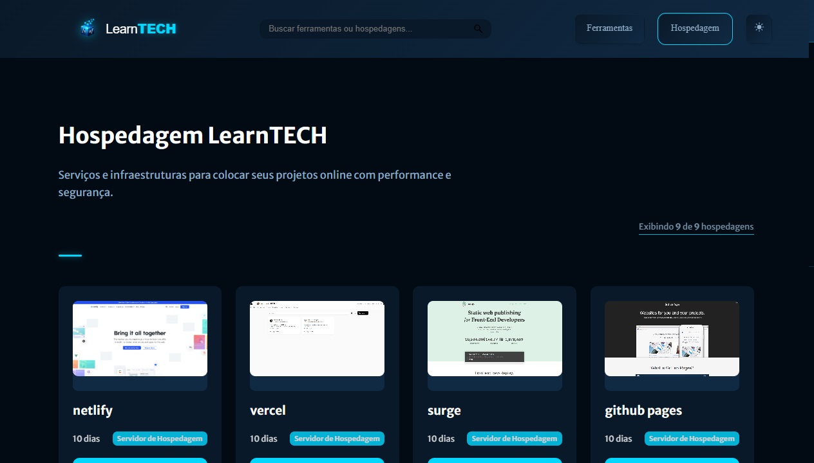
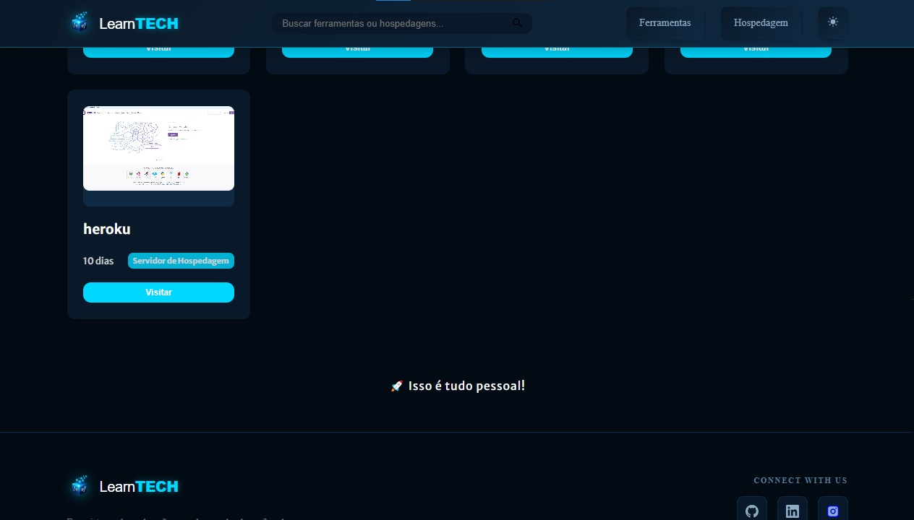
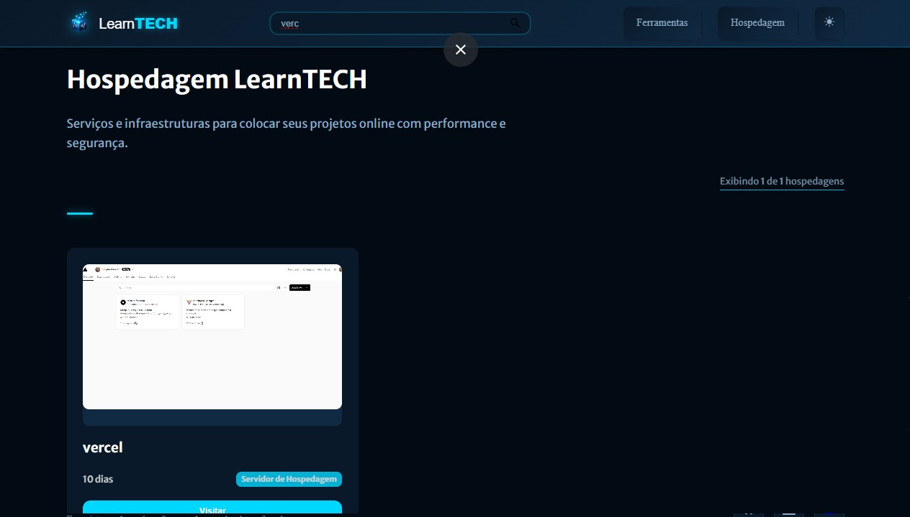
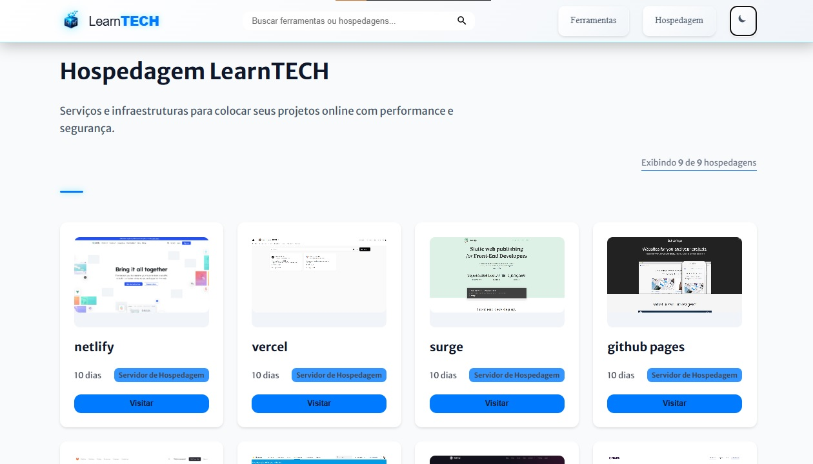

<h1 align="center">🧰 Tools</h1>

<p align="center">
  <strong>O catálogo de ferramentas do ecossistema learnTECH.</strong><br />
  45 ferramentas · 10 hospedagens · 12 categorias
</p>

<p align="center">
  
  
  
  
</p>

---

## 🧭 Sobre

Reúne, num lugar só, os serviços que eu realmente usei em projetos reais —
atuando como desenvolvedor e como product manager. Cada item entrou na lista
porque resolveu um problema concreto, não porque aparece em ranking de blog.

A proposta é direta: quando alguém precisa de uma ferramenta para uma tarefa
específica — prototipar uma tela, testar uma API, medir a performance de uma
página, escolher uma paleta, colocar o projeto no ar — a resposta já está
catalogada, com o que ela faz, a categoria e o modelo de cobrança.

**Para quem:** pessoas desenvolvedoras, product managers, designers e demais
profissionais de tecnologia que perdem tempo procurando a ferramenta certa.

**O que não é:** um diretório exaustivo. É uma seleção.

---

## 📌 Informações úteis

| | |
| --- | --- |
| **Catálogo** | 45 ferramentas em 12 categorias + 10 hospedagens em 3 |
| **Stack** | HTML5, CSS3 e JavaScript ES6 — sem framework, sem build, zero dependência |
| **Hospedagem** | GitHub Pages (`.nojekyll` na raiz) |
| **Tema** | Claro e escuro, seguindo o sistema na primeira visita e salvando a escolha |
| **Externo** | Apenas Google Fonts — os ícones são SVG embutidos no HTML |

### ▶️ Como rodar localmente

O projeto usa **módulos ES6**. Abrir o `index.html` com duplo clique **não
funciona** — o navegador bloqueia módulos carregados via `file://`. É preciso
servir por HTTP:

```bash
# com Node
npx serve .

# ou com Python
python -m http.server 3000
```

Depois abra `http://localhost:3000`.

### ➕ Como adicionar um item ao catálogo

1. Coloque a miniatura em `assets/thumb_tools/` (ou `assets/thumb_host/`)
2. Adicione um objeto ao array em `data/tools.js` (ou `data/host.js`)
3. Pronto — não há build, a página lê o array direto

O objeto tem seis campos obrigatórios e um opcional:

```js
{
  title: "Squoosh",
  description: "Comprime e converte imagem para WebP e AVIF dentro do próprio navegador.",
  category: "Performance",
  pricing: "Gratuito",              // Gratuito | Freemium | Pago
  thumb: "./assets/thumb_tools/squoosh.jpg",
  thumbFit: "contain",              // opcional: use com logo em vez de captura de tela
  site_url: "https://squoosh.app/",
}
```

A categoria **não precisa ser cadastrada em lugar nenhum**: a barra de filtros é
montada a partir dos próprios dados, com a contagem de cada uma.

---

## ✨ O que a interface faz

- **Duas seções** — Ferramentas e Hospedagens, em abas
- **Filtro por categoria** com a contagem de cada uma; clicar de novo desmarca
- **Busca** por nome, descrição, categoria ou modelo de cobrança — ignora acento,
  então "codigo" encontra "Código"
- **Atalho `/`** para focar a busca e `Esc` para limpar
- **URL compartilhável** — `?s=host&c=Aplicação` reabre exatamente aquele recorte
- **Paginação incremental** — 12 iniciais, +12 por clique
- **Carregamento preguiçoso** das imagens via `IntersectionObserver`
- **Tema claro e escuro** respeitando a preferência do sistema na primeira visita
- **Card inteiro é um link** — abre em nova aba, com `rel="noopener noreferrer"`
  e nome acessível próprio

---

## 🗂️ Estrutura de pastas

```text
tools/
├── index.html              estrutura da página, ícones SVG e o <template> do card
├── main.js                 ponto de entrada: entrega os dados para a aplicação
│
├── data/
│   ├── tools.js            45 ferramentas
│   └── host.js             10 hospedagens
│
├── js/
│   ├── renderer.js         a aplicação: seção, filtro, busca, paginação, tema, URL
│   └── utils.js            debounce e normalização de texto
│
├── css/
│   ├── layout.css          tokens de tema, base tipográfica, grade e filtros
│   ├── header.css          cabeçalho fixo, abas, busca e alternância de tema
│   ├── cards.css           o card do catálogo
│   └── footer.css          rodapé
│
├── assets/
│   ├── thumb_tools/        miniaturas das ferramentas
│   ├── thumb_host/         miniaturas das hospedagens
│   └── logos/              identidade visual
│
├── public/                 favicons, manifest e a imagem de compartilhamento
└── .github/                capturas de tela usadas neste arquivo
```

### Como os arquivos se conversam

```text
main.js
   ├── data/tools.js ─┐
   ├── data/host.js ──┤
   └── js/renderer.js ┘── monta filtros, grade, busca e paginação
                          └── js/utils.js
```

Não existe camada de componente: o card é um `<template>` no HTML, clonado a cada
renderização. Um item novo no catálogo não cria arquivo nenhum.

---

## 🎨 Design

O tema é definido por variáveis CSS em `css/layout.css`, em dois blocos —
`:root` para o escuro e `[data-theme="light"]` para o claro. **Toda variável
existe nos dois blocos**, o que evita cor de um tema vazando no outro.

| | Escuro | Claro |
| --- | --- | --- |
| Fundo | `#0c0d10` | `#faf9f7` |
| Superfície | `#141519` | `#ffffff` |
| Texto | `#f2f3f5` | `#16181d` |
| Destaque | `#ffb224` | `#b45309` |

Tipografia: **Space Grotesk** nos títulos, **Inter** no texto.

Trocar a cor de destaque do projeto inteiro é mexer em `--accent`, `--accent-soft`
e `--accent-on` — três linhas por tema.

### Princípios adotados

- **Um destaque só.** A cor de destaque marca o que está ativo e o que é gratuito.
  Não há brilho decorativo espalhado pela tela.
- **Superfície sólida.** Sem vidro fosco e sem `backdrop-filter`.
- **O card informa.** Nome, o que a ferramenta faz, categoria e cobrança —
  dá para decidir sem clicar.
- **Movimento com função.** Uma entrada suave quando o resultado muda,
  e nada mais. `prefers-reduced-motion` é respeitado.

---

## 📍 Momento atual

O catálogo está no ar e funcional. A versão 3 reescreveu a interface inteira e
trocou o modelo de dado.

### Concluído

- [x] Catálogo de 45 ferramentas e 10 hospedagens
- [x] Campo de descrição em todos os itens
- [x] Campo de modelo de cobrança (Gratuito / Freemium / Pago)
- [x] Categorias reorganizadas — de 16 (oito com um item só) para 12
- [x] Filtro por categoria com contagem
- [x] Busca sem sensibilidade a acento
- [x] Estado na URL, compartilhável
- [x] Card como âncora real, com `noopener` e nome acessível
- [x] Tema claro e escuro sem vazamento de variável
- [x] Ícones SVG embutidos — o CDN de ícones externo saiu
- [x] Imagem de compartilhamento (`og:image`) e caminhos do manifest corrigidos
- [x] Carregamento preguiçoso das imagens

### Em aberto

| Prioridade | Item |
| --- | --- |
| 🔴 | Converter as miniaturas de `.jpg` para `.webp` — hoje são 12 MB em `assets/` |
| 🟡 | Trocar captura de tela por favicon do serviço: resolve peso e legibilidade |
| 🟡 | O HTML servido chega vazio ao buscador — o catálogo é montado por JavaScript |
| 🟡 | Miniatura própria para os quatro itens novos (hoje usam link externo) |
| 🟢 | Remover arquivos não referenciados em `assets/` (~2,2 MB) |
| 🟢 | Definir e publicar a URL de produção neste arquivo |

---

## 🗺️ Próximos passos

### Fase 1 — Peso

- [ ] Converter `assets/thumb_tools/` e `assets/thumb_host/` para `.webp`
- [ ] Remover os arquivos órfãos: `logos/logo-tools-1.png`, `thumbs/tool-1.jpg`,
      `icons/image.jpg`, `icons/*.svg`, `thumb_tools/tools.jpg`,
      `thumb_host/host.jpg`, `avatar.jpg`

### Fase 2 — Miniaturas

- [ ] Decidir entre captura de tela e favicon do serviço
- [ ] Gerar as miniaturas de PageSpeed Insights, Squoosh, Data Studio e
      Cloudflare Pages

### Fase 3 — Descoberta

- [ ] Resolver a indexação do catálogo pelos buscadores
- [ ] `canonical` e `og:url` com a URL de produção

### Fase 4 — Catálogo

- [ ] Revisar as hospedagens sem plano gratuito (Railway, Heroku)
- [ ] Avaliar se Pusher continua em Hospedagens ou muda de lugar
- [ ] Crescer as categorias novas: Performance (2) e Dados (1)

---

## 📚 O catálogo

### Ferramentas

| Categoria | Itens |
| --- | --- |
| Comunidade | 7 |
| Design | 6 |
| Imagens | 5 |
| Código | 4 |
| Produtividade | 4 |
| Ícones | 4 |
| Marca e Site | 4 |
| Versionamento | 3 |
| Cores | 3 |
| Back-end | 2 |
| Performance | 2 |
| Dados | 1 |

### Hospedagens

| Categoria | Itens |
| --- | --- |
| Site Estático | 6 |
| Aplicação | 3 |
| Tempo Real | 1 |

---

## 🌿 Workflow em branches

| Branch | Papel |
| --- | --- |
| `main` | em produção |
| `developer` | avaliação antes de subir |
| `feature/versao-1` | funcionalidades da primeira versão |
| `feature/versao-2` | funcionalidades da segunda versão |
| `feature/improvements` | melhorias apontadas pelo QA-1 |
| `hotfix/deploy-image` | correção do QA-2, caminho das imagens no GitHub Pages |
| `bugfix/menu-mobile-responsividade` | correções do QA-3 |

---

## 🕓 Histórico

### Versão 3 — reconstrução da interface

Diagnóstico que motivou a reescrita: o card mostrava uma captura de tela
ilegível em 300px, um badge de categoria e um campo `duration` em que 37 dos 42
itens diziam "1 dia". Nenhum card explicava o que a ferramenta fazia. O problema
não era de CSS — era de dado.

O que mudou:

- `description` e `pricing` entraram; `duration` saiu
- 16 categorias viraram 12, sem categoria de item único a não ser as duas novas
- Filtro por categoria passou a existir na interface
- O botão `window.open` virou âncora
- A identidade visual saiu do vidro fosco com neon para superfície sólida
- Quatro itens novos: PageSpeed Insights, Squoosh, Data Studio e Cloudflare Pages

### Versão 2 — catálogo com duas seções

Menu, lista de cards, paginação, busca, contador de resultados, rodapé,
modo claro e escuro, e a separação entre Ferramentas e Hospedagens.

<details>
<summary>Ver as telas da versão 2</summary>







</details>

### Versão 1 — o desafio de origem

O projeto nasceu do desafio de portfólio da [Rocketseat](https://www.rocketseat.com.br/):
construir uma página de portfólio e currículo com HTML e CSS, a partir de um
layout no Figma. Dali vieram a fonte Merriweather Sans, a grade em flexbox e a
primeira versão dos cards.

<details>
<summary>Ver as telas da versão 1</summary>


</details>

---

## 🤝 Contribuir

Sugestão de ferramenta é bem-vinda — abra uma
[issue](https://github.com/douglasabnovato/tools/issues) dizendo qual é o
serviço, o que ele faz e em que situação ele te salvou. O critério de entrada é
esse último: uso real, não popularidade.

---

<p align="center">
  Feito por <a href="https://github.com/douglasabnovato">Douglas A. B. Novato</a> ·
  <a href="https://www.linkedin.com/in/douglasabnovato/">LinkedIn</a>
</p>
